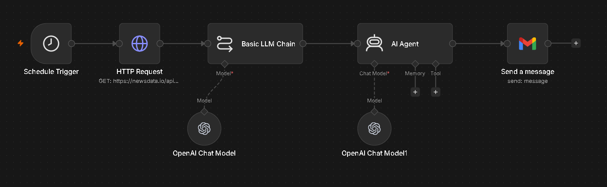

# Daily Top 10 News AI Agent

An automated n8n workflow that fetches the latest Indian news, summarizes it using GPT-5.5, formats it into an email newsletter, and sends it via Gmail every day.

## Features

- Fetches latest news from NewsData.io
- AI-powered news summarization
- Professional email formatting
- Gmail integration
- Daily scheduled execution

## Tech Stack

- n8n
- OpenAI GPT-5.5
- NewsData.io API
- Gmail API

## Workflow

Schedule Trigger
→ Fetch News
→ GPT Summarization
→ HTML Formatting
→ Gmail Delivery

## Automation Time

Runs daily at 1:00 AM IST.

## Screenshots

### Workflow Overview

## Email Report 

## Author

Aditya Kumar Yadav
